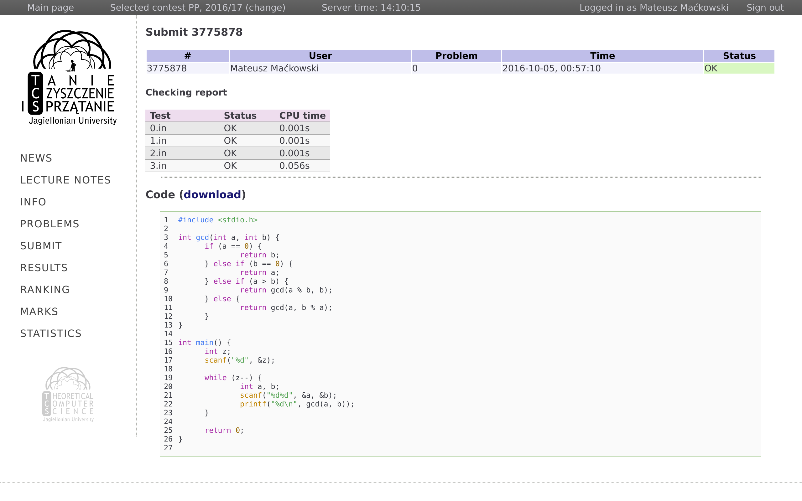

satori-enhancements
===================
_a.k.a. Satori Premium_

satori-enhancements is a WebExtension built for Jagiellonian University's
[Satori Online Judge](https://satori.tcs.uj.edu.pl) website. The main goal is
to improve usability, ease of use and add some useful features, that should
have been there since the beginning (but for some reason, they aren't).



## Features
* General:
  * Removing UI clutter
  * Replacing some image assets (e.g. Satori Premium logo) with an option to configure what are they changed to
  * Improving styles (e.g. using more distinctive link color)
  * Adding tab-order in forms for quicker navigation
  * Auto-redirect to the recent contest when opening homepage URL
  * Maintain login state between browsing sessions
* Problems:
  * "Results" link for each problem
  * Highlighting problems according to their best status (OK/ANS or other error)
  * Ability to hide particular problems and remembering hidden problem groups
* Ranking:
  * Ability to sort ranking tables by given column
  * Search box to filter rows
  * Sticking the table header and two leftmost columns (Rank/Lp and Name) when scrolling so they're always visible
* Submit:
  * Allow pasting code instead of selecting local file when submitting
  * Auto-redirect to the latest results page after submitting a solution
* Results:
  * Auto-refreshing results page and notifying about problem status changes
  * Syntax highlighting with configurable style

## Building
First, make sure you have git and [yarn](https://yarnpkg.com/) installed. Then:
```
$ git clone https://github.com/m4tx/satori-enhancements.git
$ cd satori-enhancements
$ yarn
```
`yarn` will automatically execute `gulp`, which will create `dist/`
directory with all necessary files, that can be used to pack or load extension
inside Chrome. Executing `gulp compress` (assuming you have gulp installed
globally) can also be used to put these files inside a zip package (inside
`bin/`) which can be sent to the AMO or Chrome Web Store Developer Dashboard.
See `gulpfile.js` for more gulp tasks.

## Download
* [Chrome Web Store](https://chrome.google.com/webstore/detail/satori-enhancements/oghiinfmhnkmfecckbpcoieaieobblog)
* [AMO (Firefox Add-ons)](https://addons.mozilla.org/firefox/addon/satori-enhancements/)

## Attribution
* `ext/images_src/alttcs.psd` (derived images: `ext/images_src/alttcs.xcf`, `ext/images/alttcslogo.png`) was originally created by Adam Pardyl
